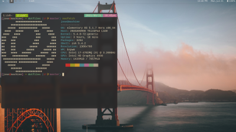

# dotfiles
  <!--table-->
 <table align='center'>
   <tr>
     <td id="coding1" align='center' border='0px'></img></td>
   </tr>
 </table>

here are all my dotfiles with all my configurations, if you have some advices for me you can create pull request....

